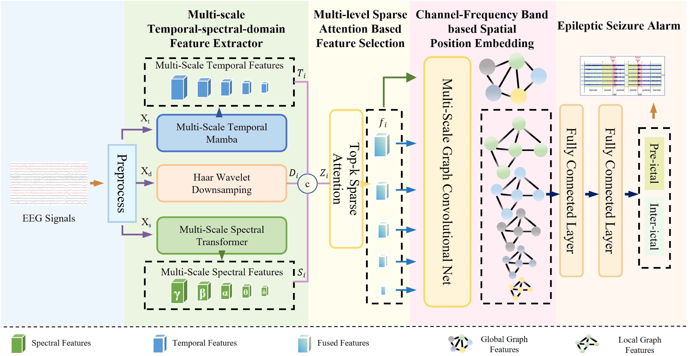

# MS-SSA-HGCN: Multi-Scale spatio-temporal–spectral Sparse Attention–Based hierarchical graph convolutional network for Seizure Prediction

This repository contains the implementation of **MS-SSA-HGCN** (Multi-Scale spatio-temporal–spectral Sparse Attention–Based hierarchical graph convolutional network for
Seizure Prediction) for epileptic seizure prediction using EEG signals from the CHB-MIT dataset.

## Installation

### Requirements

- Python 3.7+
- CUDA 11.0+ 

### Install Dependencies

```bash
pip install -r requirements.txt
```

## Usage

### Step 1: Download CHB-MIT Dataset

Download the CHB-MIT Scalp EEG Database from PhysioNet:

```bash
# Visit: https://physionet.org/content/chbmit/
# Download all EDF files and extract to data/raw/chb/
```

Expected directory structure:
```
data/
└── raw/
    └── chb/
        ├── chb01/
        │   ├── chb01_01.edf
        │   ├── chb01_02.edf
        │   └── ...
        ├── chb02/
        └── ...
```

### Step 2: Preprocess Data

```bash
cd preprocessing
python data_processor.py --patient_id=1 --data_path=../data/processed/chb
```

### Step 3: Train Patient 1


```bash
cd scripts
python train.py --patient_id=1
```

### Step 4: Test Patient 1


```bash
cd scripts
python test.py --patient_id=1
```